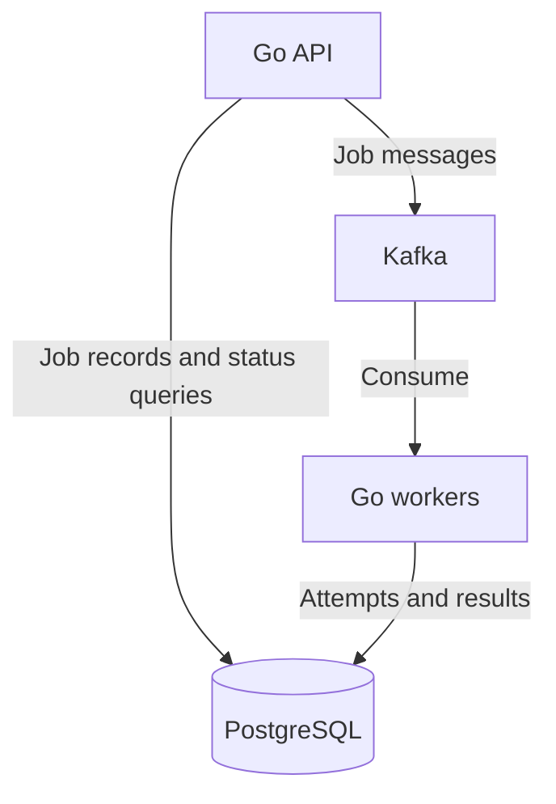

# Relay

### Distributed job processing with Go, Kafka, and PostgreSQL

Relay is a backend systems project designed to move work out of the request path and into independently running workers. Its architecture combines a job submission API, a durable message queue, and persistent job records so clients can submit work and retrieve its outcome later.

The core workload is report generation: submit a collection of numbers and receive a summary containing the count, sum, minimum, maximum, and mean. The workload stays simple so the focus remains on coordination, message delivery, retries, and recovery.

## Architecture



| Technology | Role |
| --- | --- |
| **Go** | HTTP API and background worker processes |
| **Kafka** | Durable message transport and work distribution through consumer groups |
| **PostgreSQL** | Persistent job state, attempt history, and report results |
| **Docker Compose** | Local service orchestration |

## Job lifecycle

1. A client submits report input to the API.
2. The API validates the request and assigns a job ID.
3. The job is persisted and dispatched through Kafka.
4. A worker processes the input and stores the outcome in PostgreSQL.
5. The client retrieves the job status and result using the job ID.

The API contract separates submission from execution. Clients track jobs without keeping a request open while a worker runs.

## API contract

| Method | Endpoint | Purpose |
| --- | --- | --- |
| `POST` | `/jobs` | Submit a report job |
| `GET` | `/jobs/{id}` | Retrieve job status, attempts, and result |
| `GET` | `/health` | Check API process health |

Example report input:

```json
{
  "numbers": [10, 20, 30, 40, 50]
}
```

Expected report:

```json
{
  "count": 5,
  "sum": 150,
  "min": 10,
  "max": 50,
  "mean": 30
}
```

## Reliability design

The design centers on **at-least-once delivery**: a message can be delivered again after a failure, so processing must account for duplicates.

- **Durable state:** PostgreSQL is the source of truth for job status and results.
- **Bounded retries:** transient failures receive a limited number of attempts before a job reaches a terminal failure state.
- **Duplicate protection:** job IDs provide a stable identity for preventing duplicate stored results during redelivery.
- **Offset ordering:** Kafka offsets are committed after the processing outcome is durably recorded.
- **Worker distribution:** workers share a Kafka consumer group, with available parallelism determined by topic partitions.

Persisting a job and publishing its message are separate operations. Handling failures between those operations is part of the delivery design, alongside worker crashes before and after result persistence.

## Engineering focus

Relay explores the boundaries between request handling, message transport, and durable storage. The key tradeoff is accepting possible redelivery in exchange for recoverable processing, while using persistent state to keep results consistent.

The deployment scope is a local Docker environment with one Kafka broker and one PostgreSQL instance. Worker-level recovery and horizontal worker execution are the focus; broker replication and database failover are outside this scope.
